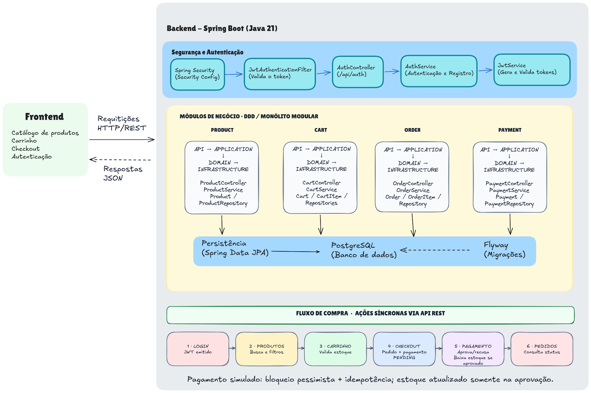
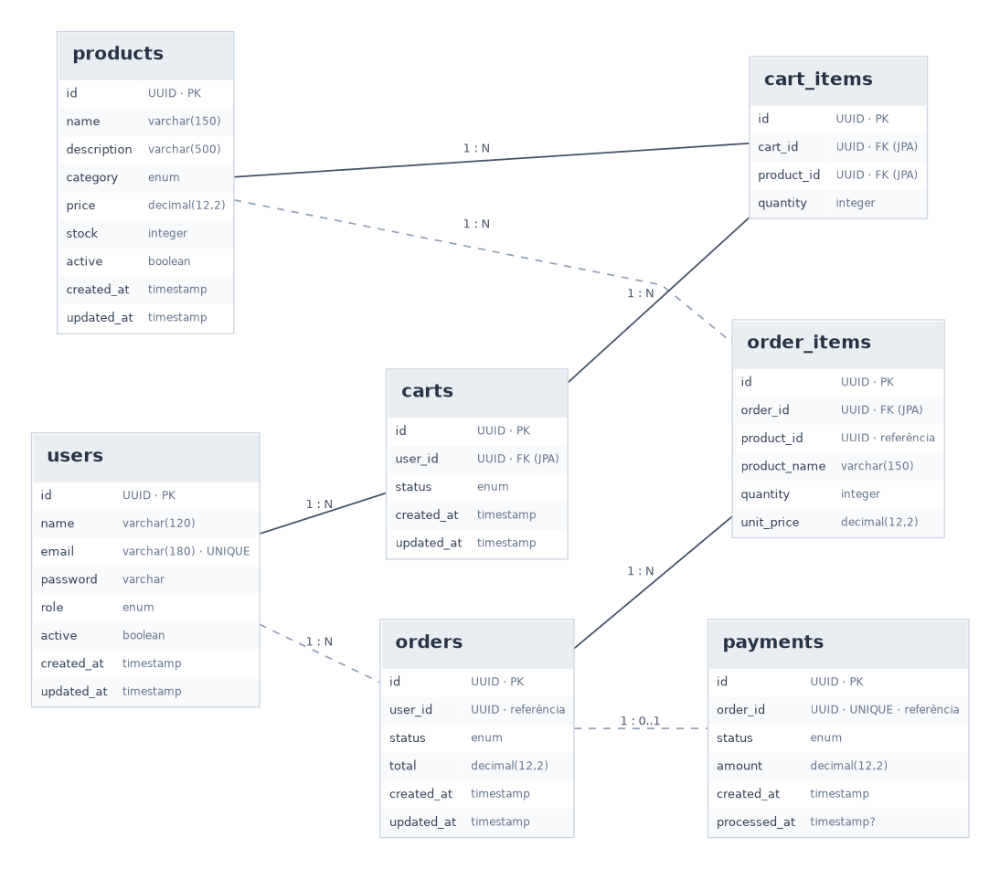

# 🦫 Coração Market

O Coração Market é uma aplicação web de supermercado desenvolvida para ser uma interface de fácil usabilidade, oferecendo uma experiência de compra simples, intuitiva e segura.

O projeto contempla o fluxo de compras de ponta a ponta, desde a navegação pelo catálogo e gerenciamento do carrinho até a finalização de pedidos e simulação de pagamentos.

Além das funcionalidades, a solução prioriza a organização do código, a separação de responsabilidades e a comunicação entre frontend e backend por meio de uma API REST.

## Técnologias utilizadas

O backend do Coração Market foi desenvolvido com **Java 21 e Spring Boot 3.5.16**, adotando uma organização orientada ao domínio para separar regras de negócio, responsabilidades técnicas e infraestrutura.

| Categoria | Tecnologia | Finalidade |
|---|---|---|
| **Linguagem** | Java 21 | Implementação das regras de negócio e utilização dos recursos modernos da linguagem. |
| **Framework** | Spring Boot 3.5.16 | Desenvolvimento da API REST e gerenciamento dos componentes da aplicação. |
| **Arquitetura** | Domain-Driven Design (DDD) | Organização das funcionalidades em módulos orientados ao domínio. |
| **Persistência** | Spring Data JPA / Hibernate | Mapeamento objeto-relacional e acesso aos dados. |
| **Banco de dados** | PostgreSQL | Armazenamento relacional de usuários, produtos, carrinhos, pedidos e pagamentos. |
| **Migrações** | Flyway | Versionamento e aplicação controlada das alterações no banco de dados. |
| **Segurança** | Spring Security | Autenticação, autorização e proteção dos endpoints. |
| **Autenticação** | JWT / JJWT 0.12.6 | Geração e validação de tokens de autenticação. |
| **Validação** | Jakarta Bean Validation | Validação dos dados recebidos pela API. |
| **Testes** | JUnit 5 / Mockito | Testes automatizados e isolamento de dependências por meio de mocks. |
| **Documentação** | Springdoc OpenAPI / Swagger UI | Documentação interativa dos endpoints REST. |
| **Observabilidade** | Spring Boot Actuator | Disponibilização de recursos de monitoramento e verificação da saúde da aplicação. |
| **Build** | Maven | Gerenciamento de dependências, compilação e execução de testes. |


### Arquitetura e Organização do código

O backend do Coração Market foi estruturado como um monólito modular, seguindo uma abordagem inspirada em Domain-Driven Design (DDD) e separação de responsabilidades em camadas.
A aplicação está organizada por domínios de negócio — autenticação, produtos, carrinho, pedidos e pagamentos —, permitindo que cada módulo concentre suas funcionalidades e regras.



* **Organização dos Módulos**

| Módulo | Responsabilidade |
|---|---|
| `auth` | Cadastro, autenticação e emissão de tokens JWT. |
| `user` | Representação dos usuários da aplicação. |
| `product` | Gerenciamento e consulta do catálogo de produtos. |
| `cart` | Gerenciamento dos carrinhos e seus itens. |
| `order` | Criação e acompanhamento dos pedidos. |
| `payment` | Processamento e simulação de pagamentos. |
| `shared` | Configurações, exceções e componentes compartilhados. | 

* **Separação em camadas**

| Camada | Responsabilidade |
|---|---|
| **API** | Exposição dos endpoints REST, recebimento de requisições e definição dos contratos de comunicação. |
| **Application** | Coordenação dos casos de uso e execução dos fluxos da aplicação. |
| **Domain** | Representação dos conceitos e das regras centrais do negócio. |
| **Infrastructure** | Implementações técnicas, como persistência e integrações com frameworks. |

* **Estrutura oprganizacional**
```text
backend/
├── src/
│   ├── main/
│   │   ├── java/br/com/coracaomarket/
│   │   │   ├── auth/             # Autenticação e segurança
│   │   │   ├── user/             # Usuários
│   │   │   ├── product/          # Catálogo de produtos
│   │   │   ├── cart/             # Carrinho de compras
│   │   │   ├── order/            # Pedidos
│   │   │   ├── payment/          # Pagamentos
│   │   │   └── shared/           # Configurações e componentes comuns
│   │   └── resources/           # Configurações e migrações do banco
│   └── test/                    # Testes automatizados
└── pom.xml                      # Dependências e configuração Maven
```

Os principais módulos seguem a organização:

```text
product/
├── api/              # Controllers e DTOs
├── application/      # Casos de uso e serviços
├── domain/           # Entidades e regras de negócio
└── infrastructure/   # Persistência e implementações técnicas
```

### PostgreSQL e Flyway

O **PostgreSQL** foi escolhido por sua confiabilidade, suporte a transações e capacidade de preservar a integridade dos dados relacionais.

A persistência é realizada com **Spring Data JPA**, utilizando o Hibernate como implementação ORM.
Para o gerenciamento do esquema do banco de dados, foi adotado o **Flyway**, permitindo versionar alterações estruturais




### Spring Security e JWT

A autenticação é implementada com **Spring Security** e **JSON Web Tokens (JWT)**, utilizando a biblioteca JJWT para geração e validação dos tokens.
Após a autenticação, o cliente utiliza o token JWT para acessar os recursos protegidos da API.

A escolha pelo JWT considera sua ampla adoção, maturidade e suporte no ecossistema Java

A abordagem permite centralizar as regras de autenticação e autorização

### Testes automatizados

Para os testes automatizados, foram utilizados **JUnit 5** e **Mockito**, ferramentas consolidadas e amplamente integradas ao ecossistema Spring Boot.

A escolha considera sua confiabilidade, documentação e facilidade de integração, permitindo desenvolver testes de maneira prática e eficiente.

O JUnit é responsável pela estruturação e execução dos testes, enquanto o Mockito permite simular dependências e isolar os componentes avaliados, facilitando a validação das regras de negócio.

### Documentação

A API utiliza **Springdoc OpenAPI**, disponibilizando documentação interativa por meio do **Swagger UI** e facilitando a exploração dos endpoints.

O projeto também inclui **Spring Boot Actuator**, oferecendo recursos de observabilidade e monitoramento da aplicação.

## Executando o backend

### Pré-requisitos

Para executar a aplicação localmente, é necessário ter:
* Java 21
* PostgreSQL
* Maven
* Git

1. ###  Clone o repositório

> git clone https://github.com/helterpinheiro/coracao-market.git

> cd coracao-market/backend

2. ### Configure o banco de dados

Crie um banco PostgreSQL para a aplicação:

> CREATE DATABASE coracao_market;

Configure a conexão com o banco de dados de acordo com as propriedades definidas no arquivo application.properties ou application.yml do projeto.

Por exemplo, se a aplicação utilizar variáveis de ambiente:
```
export DB_URL="jdbc:postgresql://localhost:5432/coracao_market"
export DB_USERNAME="postgres"
export DB_PASSWORD="sua_senha"
```

> Atenção: os nomes DB_URL, DB_USERNAME e DB_PASSWORD são exemplos. Utilize os nomes efetivamente referenciados na configuração da aplicação.

3. ###  Configure a autenticação JWT

A aplicação utiliza tokens JWT para autenticar os usuários.
Configure a chave de assinatura e os demais parâmetros exigidos pelo JwtService, conforme as propriedades do projeto.

Não utilize segredos reais no README nem versione credenciais no Git.

4. ### Execute a aplicação
Com o Maven instalado:

> mvn spring-boot:run

Ou, caso o projeto inclua o Maven Wrapper:

> ./mvnw spring-boot:run

Com a configuração padrão do Spring Boot, a API estará disponível em:

> http://localhost:8080

O projeto utiliza Flyway para gerenciar as migrações do banco de dados. Quando corretamente configuradas, as migrações são aplicadas durante a inicialização da aplicação.

5. ###  Acesse a documentação interativa
Com a aplicação em execução, acesse:

**Swagger UI:**

> http://localhost:8080/swagger-ui/index.html

**OpenAPI:**

> http://localhost:8080/v3/api-docs

**Health Check**

> http://localhost:8080/actuator/health

6. ### Execute os testes

> mvn test

Os testes utilizam o ecossistema JUnit e Mockito, com cobertura implementada em componentes de produtos e pagamentos.

## Executando com Docker

O projeto utiliza **Docker e Docker Compose** para facilitar a configuração e a execução do ambiente, incluindo o backend Spring Boot e o banco de dados PostgreSQL.

### Pré-requisitos
- Docker
- Docker Compose

### 1. Inicie os containers

Na raiz do projeto, execute:

```bash
docker compose up --build -d
```

### 2. Verifique a execução

```bash
docker compose ps
```

Para acompanhar os logs do backend:

```bash
docker compose logs -f backend
```

### 3. Acesse a aplicação

Com os serviços inicializados:

- **API:** http://localhost:8080
- **Swagger UI:** http://localhost:8080/swagger-ui/index.html
- **Health Check:** http://localhost:8080/actuator/health

### 4. Encerre os containers

```bash
docker compose down
```

> As migrações do banco de dados são gerenciadas automaticamente pelo **Flyway** durante a inicialização da aplicação.

## Exemplos de uso da API

A API utiliza JSON para comunicação e JWT para autenticação dos endpoints protegidos.

Nos exemplos abaixo, considere:

> Base URL: http://localhost:8080

1. ### Cadastrar um usuário

> Endpoint: POST /api/auth/register

```
curl -X POST http://localhost:8080/api/auth/register \
  -H "Content-Type: application/json" \
  -d '{
    "name": "João Silva",
    "email": "joao@email.com",
    "password": "SenhaSegura123"
  }'
```

2. ### Realizar login

 > Endpoint: POST /api/auth/login

```
curl -X POST http://localhost:8080/api/auth/login \
  -H "Content-Type: application/json" \
  -d '{
    "email": "joao@email.com",
    "password": "SenhaSegura123"
  }'
```

3. ### Consultar produtos

> Endpoint: GET /api/products

A consulta ao catálogo é pública e permite filtrar produtos por nome e categoria, além de utilizar paginação.

**Lista produtos:**

> curl "http://localhost:8080/api/products"

**Pesquisa pelo nome**

> curl "http://localhost:8080/api/products?name=arroz"

**Consulta com paginação**

> curl "http://localhost:8080/api/products?page=0&size=10"

4. ### Consultar o carrinho

> Endpoint: GET /api/cart


```
curl -X GET http://localhost:8080/api/cart \
  -H "Authorization: Bearer SEU_TOKEN_JWT"
```

5. ### Adicionar um produto ao carrinho

> Endpoint: POST /api/cart/items

```
curl -X POST http://localhost:8080/api/cart/items \
  -H "Content-Type: application/json" \
  -H "Authorization: Bearer SEU_TOKEN_JWT" \
  -d '{
    "productId": "UUID_DO_PRODUTO",
    "quantity": 2
  }'
```

6. ### Atualizar a quantidade de um item

> Endpoint: PUT /api/cart/items/{itemId}

```
curl -X PUT http://localhost:8080/api/cart/items/UUID_DO_ITEM \
  -H "Content-Type: application/json" \
  -H "Authorization: Bearer SEU_TOKEN_JWT" \
  -d '{
    "quantity": 3
  }'
```

7. ### Remover um item do carrinho

> Endpoint: DELETE /api/cart/items/{itemId}

```
curl -X DELETE http://localhost:8080/api/cart/items/UUID_DO_ITEM \
  -H "Authorization: Bearer SEU_TOKEN_JWT"
```

8. ### Finalizar a compra

> Endpoint: POST /api/orders/checkout

```
curl -X POST http://localhost:8080/api/orders/checkout \
  -H "Authorization: Bearer SEU_TOKEN_JWT"
```

9. ### Simular o pagamento

> Endpoint: POST /api/payments/{orderId}/simulate

**Aprovar o pagamento**

```
curl -X POST \
  http://localhost:8080/api/payments/UUID_DO_PEDIDO/simulate \
  -H "Content-Type: application/json" \
  -H "Authorization: Bearer SEU_TOKEN_JWT" \
  -d '{
    "approved": true
  }'
```

**Recusar pagamento**

```
curl -X POST \
  http://localhost:8080/api/payments/UUID_DO_PEDIDO/simulate \
  -H "Content-Type: application/json" \
  -H "Authorization: Bearer SEU_TOKEN_JWT" \
  -d '{
    "approved": false
  }'
```

10. ### Consultar o histórico de pedidos

> Endpoint: GET /api/orders

```
curl -X GET http://localhost:8080/api/orders \
  -H "Authorization: Bearer SEU_TOKEN_JWT"
```

11. ### Consultar um pedido específico

> Endpoint: GET /api/orders/{orderId}

```
curl -X GET http://localhost:8080/api/orders/UUID_DO_PEDIDO \
  -H "Authorization: Bearer SEU_TOKEN_JWT"
```

